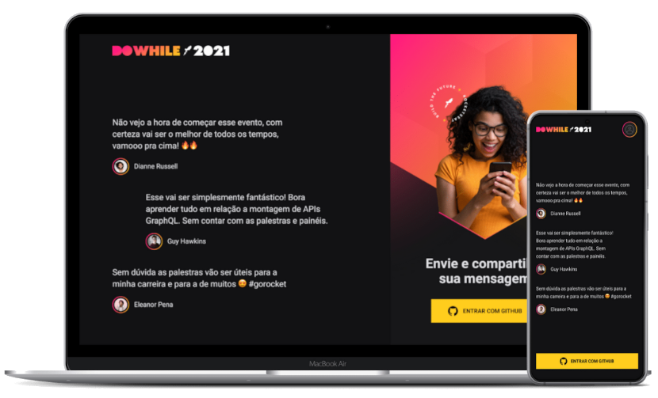

<h1 align="center">
  
</h1>

<p align="center">
  <a href="#-tecnologias">Tecnologias</a>&nbsp;&nbsp;&nbsp;|&nbsp;&nbsp;&nbsp;
  <a href="#-projeto">Projeto</a>&nbsp;&nbsp;&nbsp;|&nbsp;&nbsp;&nbsp;
  <a href="#-layout">Layout</a>&nbsp;&nbsp;&nbsp;|&nbsp;&nbsp;&nbsp;
  <a href="#-como-executar">Como executar</a>&nbsp;&nbsp;&nbsp;|&nbsp;&nbsp;&nbsp;
  <a href="#-licença">Licença</a>
</p>

<br>

<p align="center">
  
</p>

## ✨ Tecnologias

Esse projeto foi desenvolvido com as seguintes tecnologias:

- [Node.js](https://nodejs.org/en/)
- [Typescript](https://www.typescriptlang.org/)
- [Prisma](https://www.prisma.io/)
- [Express](https://expressjs.com/pt-br/)
- [Socket.io](https://socket.io/)
- [OAuth Github](https://docs.github.com/pt/developers/apps/building-oauth-apps/authorizing-oauth-apps)

## 💻 Projeto

Este projeto foi desenvolvido durante o evento **NLW Heat** para utilização como mural de mensagens do Do While 2021.

Projeto Backend desenvolvido como primeira etapa do processo, neste projeto é realizada a autenticação via OAuth com o Github e utilizando o protocolo web socket para fazer a comunicação com o lado servidor. 

Feitos os envios de mensagens, é possível visualizar através da requisição pelo Insomnia o retorno das 3 últimas mensagens. Utilizando o Prisma, é possível visualizar tanto registros de usuário quanto mensagens no banco de dados.

Este repositório faz parte da seguinte stack:

- [Backend - Node.js](https://github.com/AndreNavarro/NLW07-DoWhile-Node) 👈 Você está aqui
- [Front end - React.js](https://github.com/AndreNavarro/NLW07-DoWhile-React)
- [Mobile - React Native](https://github.com/AndreNavarro/NLW07-DoWhile-React-Native)
- [Backend - Elixir](https://github.com/AndreNavarro/NLW07-DoWhile-Elixir)

## 🔖 Layout

Você pode visualizar o layout do projeto através [desse link](https://www.figma.com/file/GaOSAvvH1R6edFXSpBJmd3/%5BNLW-Heat---Mission%3A-Impulse%5D-DoWhile2021-(Community)?node-id=2%3A3). É necessário ter conta no [Figma](https://figma.com) para acessá-lo.

## 🚀 Como Executar

- Clone este repositório
- Execute ```yarn dev``` para iniciar a aplicação.

- A aplicação estará disponível em http://localhost:4000

## 📝 Licença

Projeto desenvolvido pela Rocketseat e apresentado na **Next Level Week - Heat** (nlw #07).